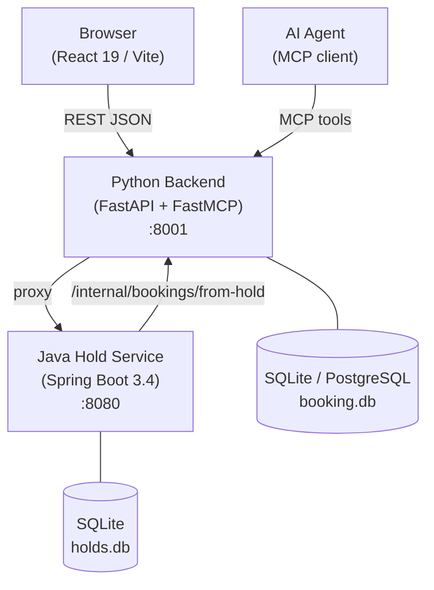
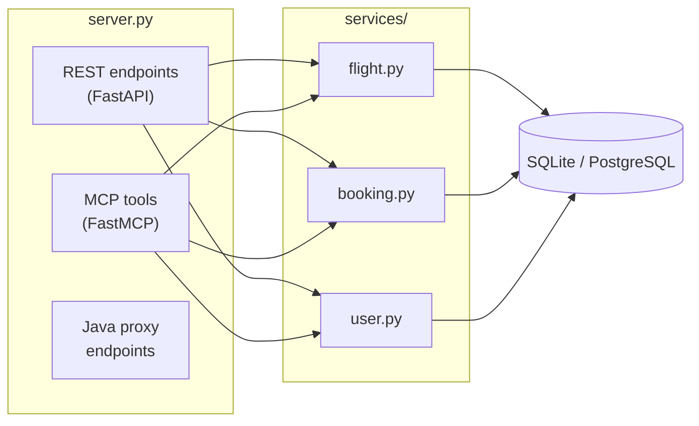
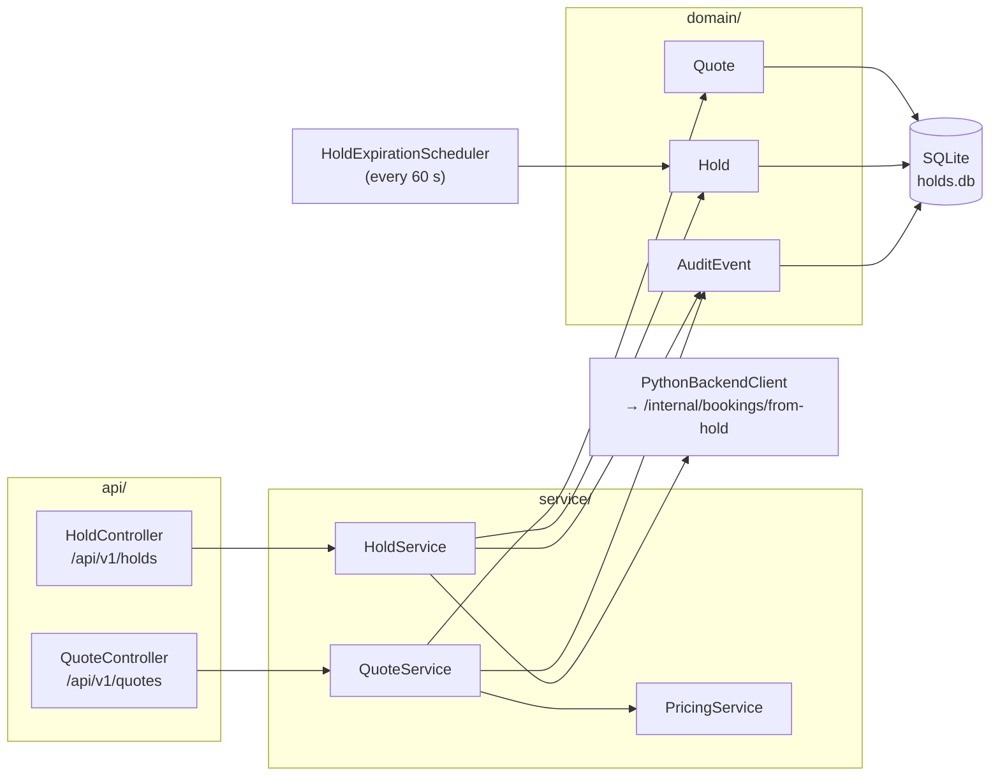
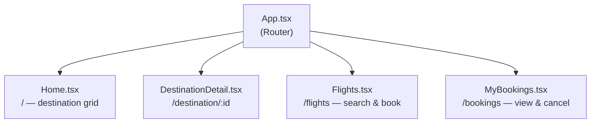
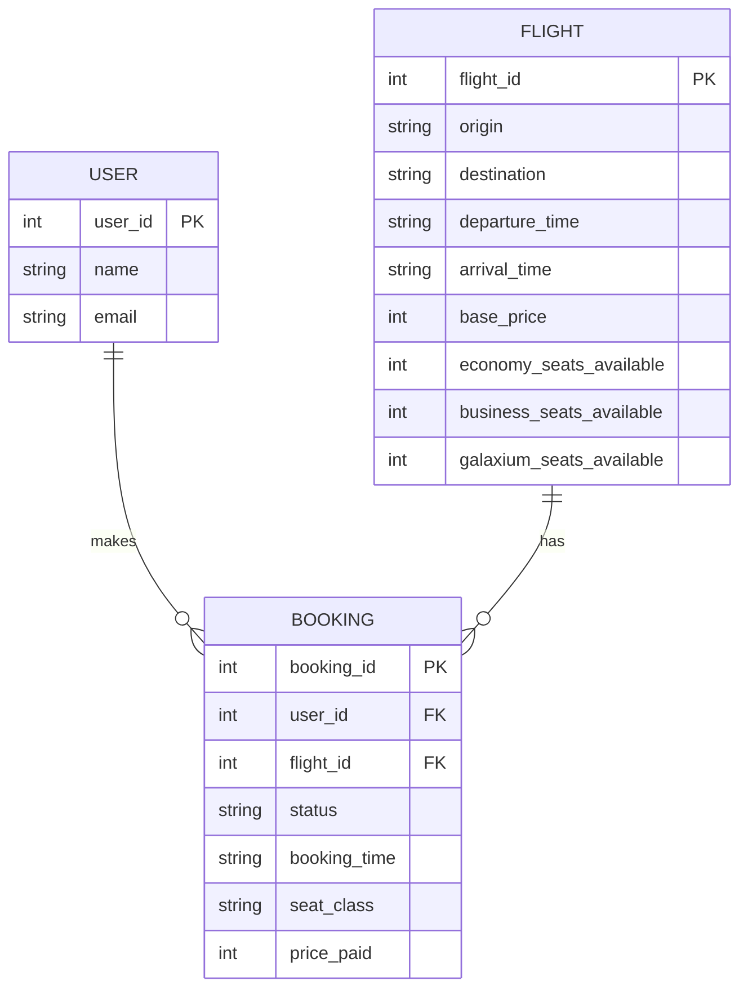
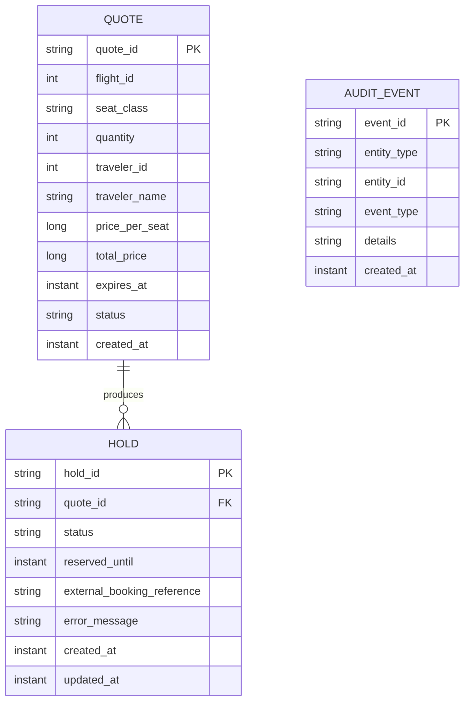
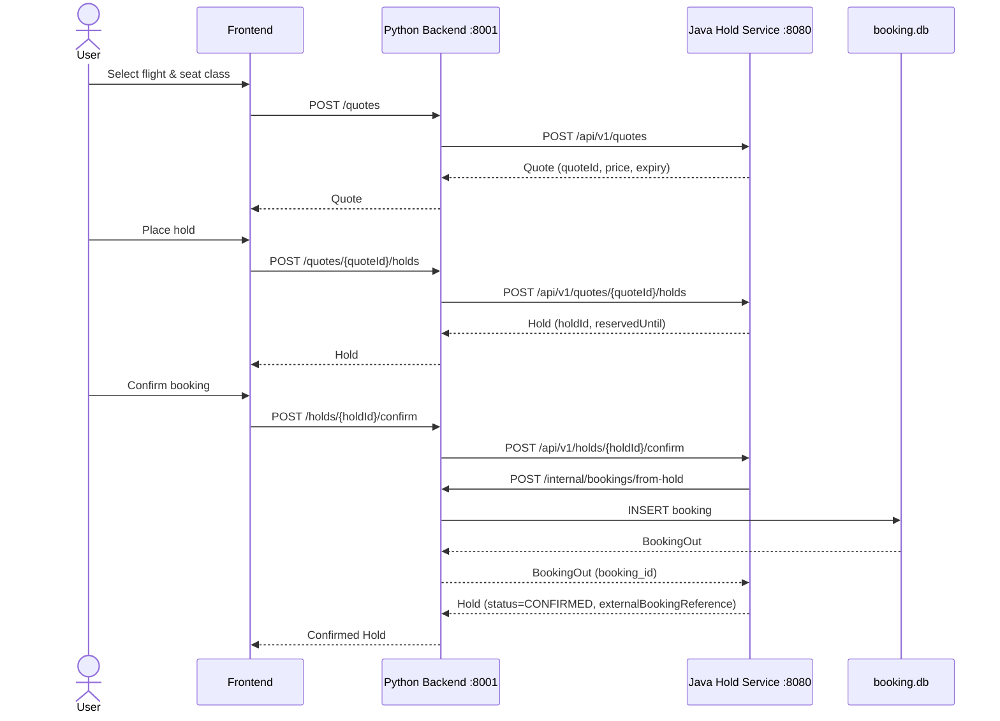
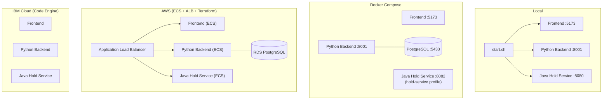

# Galaxium Travels — Architecture

Galaxium Travels is a demo interplanetary flight-booking application built across three polyglot services. It is intentionally designed to showcase the challenges AI agents face in a real enterprise-style codebase: cross-service workflows, a dual REST + MCP backend, and non-obvious architectural constraints.

---

## System overview

---

## Services

### 1. Python backend (`booking_system_backend/`)

**Stack:** Python 3, FastAPI, FastMCP, SQLAlchemy, Pydantic, Uvicorn  
**Port:** `8001`

The central service. It owns the bookings database and exposes every operation both as a standard REST API and as MCP tools so AI agents can interact with the system natively.

**Key architectural notes:**
- `FastMCP` is instantiated **before** `FastAPI` in [`server.py`](booking_system_backend/server.py:22) — required for correct lifespan composition. Swapping the order breaks the app.
- MCP tools call `SessionLocal()` directly; they do **not** use `Depends(get_db)`.
- Service functions return `Union[Model, ErrorResponse]` — callers check `isinstance(result, ErrorResponse)`, never catch exceptions.
- `book_flight()` validates both `user_id` **and** `name` — name mismatch rejects the booking.
- Proxy endpoints (`/quotes`, `/holds/*`) forward to the Java service and catch `httpx.HTTPError`, returning `{"error": "..."}` with HTTP 200. Callers must inspect the body, not just the status code.

**Internal layers:**

---

### 2. Java hold service (`booking_system_inventory_hold_service/`)

**Stack:** Java 17, Spring Boot 3.4, Hibernate/JPA, SQLite, Lombok  
**Port:** `8080`

A separate microservice that owns the quote and hold lifecycle. Holds auto-expire after 15 minutes via a background scheduler. When a hold is confirmed it calls back into the Python backend to create the real booking.

**Internal layers:**

---

### 3. Frontend (`booking_system_frontend/`)

**Stack:** React 19, TypeScript, Vite 7, Tailwind CSS 3, React Router 7, Axios, Framer Motion  
**Port:** `5173`

Single-page application. All API calls go to the Python backend — the frontend never talks directly to the Java service.

**Important:** Always inspect the `success` field or look for `error` in the response body — HTTP status is not reliable for error detection (proxy endpoints return HTTP 200 even on errors).

**Page structure:**

---

## Data model

**Java service tables (separate database):**

---

## Quote → hold → booking flow

The full cross-service workflow when a user reserves a seat before committing to a booking:

**Hold auto-expiry:** A `HoldExpirationScheduler` in the Java service polls every 60 seconds and marks any hold whose `reserved_until` has passed as `EXPIRED`.

---

## MCP tools (AI agent interface)

The Python backend mounts an MCP server at `/mcp`. All six tools map 1-to-1 to the underlying service functions:

| Tool | Maps to | Description |
|---|---|---|
| `list_flights` | `flight.list_flights()` | List all available flights |
| `book_flight` | `booking.book_flight()` | Book a seat (validates user_id + name) |
| `get_bookings` | `booking.get_bookings()` | Get all bookings for a user |
| `cancel_booking` | `booking.cancel_booking()` | Cancel a booking by ID |
| `register_user` | `user.register_user()` | Register a new user |
| `get_user_id` | `user.get_user()` | Look up a user by name + email |

---

## Deployment topology

---

## Seat classes & pricing

| Class | Price multiplier | Seat allocation | Column |
|---|---|---|---|
| Economy | 1.0× | ~60% of seats | `economy_seats_available` |
| Business | 2.5× | ~30% of seats | `business_seats_available` |
| Galaxium | 5.0× | ~10% of seats | `galaxium_seats_available` |

Each class has independent seat counters. A sold-out class does not block bookings in other classes.

---

## Testing strategy

| Layer | Tool | Database | Notes |
|---|---|---|---|
| Python unit (services) | pytest | In-memory SQLite (StaticPool) | `SessionLocal` patched in both `db` and `server` modules |
| Python REST | pytest + TestClient | In-memory SQLite (StaticPool) | |
| Java unit | Spring Test / JUnit | H2 (in-memory) | |
| End-to-end | pytest + Docker Compose | SQLite (isolated stack) | Ports 18001 / 18082 |

E2E test coverage:
- `test_smoke.py` — health, flight listing, booking happy path, name-mismatch rejection
- `test_holds.py` — full quote → hold → confirm creates a real booking; release; idempotent confirm; unknown quote; auto-expiry (hold duration shortened to 1 min in e2e)
